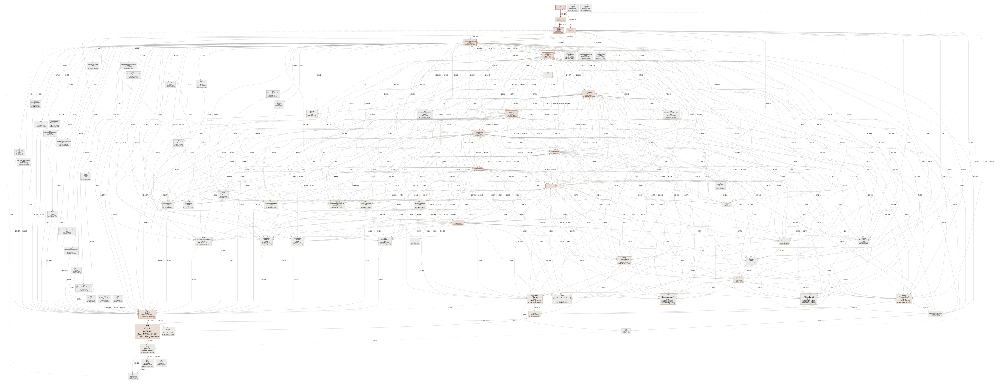

# sprof

sprof is the next revolution in Go profiling. Instead of precariously measuring the execution of your program during runtime, sprof can find performance bottlenecks using only static analysis. Say good bye to irreproducible performance issues and high overhead profiling in production and welcome your new performance overlord, sprof.

## Tutorial

Installing sprof is easy, just run:

```
go get -u github.com/felixge/sprof
```

Then go the directory of your Go program and run it:

```
sprof github.com/felixge/sprof/examples/main pprof.pb.gz
go tool pprof -http=:6060 pprof.pb.gz
```

And voila, your profile shows up:


Of course sprof also works with more complex Go projects such as [hugo](https://github.com/gohugoio/hugo):




## History

sprof is the result of months of research and engineering and was first released on 2021-04-01.

## Credits

Credit goes to [github.com/ofabry/go-callvis](github.com/ofabry/go-callvis) for providing the foundation for sprof.
